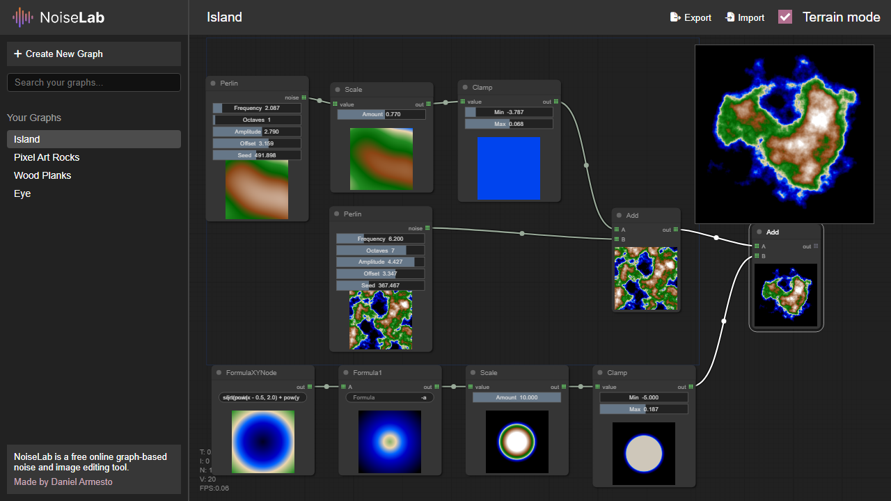
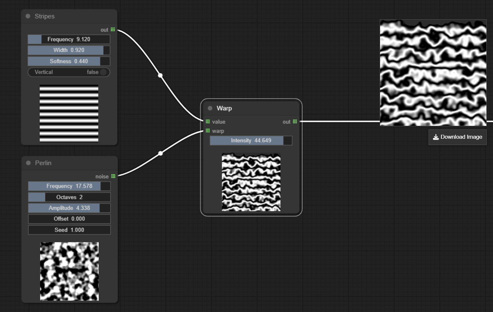
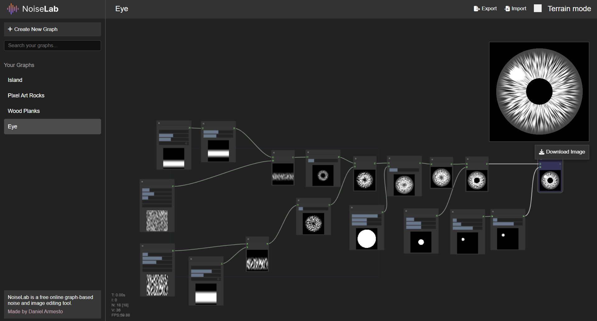

# NoiseLab

NoiseLab is a small browser-based graph editor for playing with procedural noise and texture generation. It's perfect for experimenting with noise in a simple, easy and fun way.

Open it, add some nodes, connect things together, and create something cool!

<p>
  <a href="https://xdargu.github.io/NoiseLab/">
    
  </a>
</p>



## Why I Made It

I wanted a simple playground to experiment with noise visually, but I could not find anything I liked. So I made one myself.

There are plenty of powerful procedural tools out there, but nothing to quick combine noise types, tweak values, and just see what happens. Writing noise functions in code is fun, but it is also nice to drag a few boxes around, connect them, tweak some numbers, and immediately see the result.

NoiseLab is my little version of that. It is not meant to compete with professional tools. It is more like a sketchbook for noise, masks, transforms, and weird texture ideas.

I added a "terrain mode" to convert the output noise into a heightmap interpreted a terrain. Works great to tesst ideas for procedural terrain generation!

## What It Does

- Build procedural textures with a node graph.
- Mix, transform, filter, and combine procedural image sources.
- Preview every node directly inside the graph.
- Click any node to see its output in the preview window.
- Toggle terrain mode and edit per-graph color stops to map height values to oceans, coasts, grass, hills, snow, or your own palette.
- Save graphs automatically in browser local storage.
- Export and import graph files.
- Download the generated image as a PNG.



## Getting Started

Open the live version:

https://xdargu.github.io/NoiseLab/

Or run it locally by serving the repository folder with any static file server. For example:

```bash
python -m http.server
```

Then open:

```text
http://localhost:8000
```

## Using It

Right-click or double-click in the graph area to add nodes. Connect outputs to inputs, tweak node properties, and select a node to show its result in the preview canvas.

Graphs are stored locally in your browser, so experiments stick around between sessions. You can also export graph files if you want to save or share them outside the browser.

When you open NoiseLab for the first time, it creates a few example graphs automatically: Island, Eye, Pixel Art Rocks, and Wood Planks.



## Nodes

### Generator

- **Perlin**: classic smooth gradient noise.
- **Simplex**: simplex noise, useful for organic shapes and less grid-aligned patterns.
- **DirectionalNoise**: noise with directional structure.
- **FormulaXY**: generates values from a formula using the pixel coordinates `x` and `y`.
- **Checkerboard**: alternating square pattern.
- **Hex Grid**: hexagonal grid pattern.
- **Bricks**: brick-like procedural pattern.
- **Truchet Tiles**: tiled curved pattern with randomized tile orientation.
- **Stripes**: repeated stripe pattern.
- **Gradient**: linear gradient source.
- **White Noise**: random uncorrelated noise.
- **Voronoi**: cellular distance-field style noise.
- **Cell Noise**: cell-based random pattern.
- **Circle**: circular radial mask.
- **Dots**: repeated dot pattern.
- **Ridged Noise**: noise shaped into sharper ridge-like forms.
- **Poisson Sampler**: distributes points using a Poisson-style sampling pattern.

### Transform

- **Warp**: distorts one input using another input as the warp field.
- **Rotate**: rotates the input pattern.
- **Offset**: shifts the input in X/Y.
- **Mirror**: mirrors the input across an axis.
- **Stretch**: scales the input differently across axes.
- **Cartesian to Polar**: remaps coordinates from Cartesian space into polar space.
- **Polar to Cartesian**: remaps polar-style coordinates back into Cartesian space.
- **Radial Warp**: bends the input around a radial center.
- **Tile**: repeats the input pattern.
- **Tile Sampler**: samples and repeats an input across tiles.
- **Displace**: offsets pixels using another input as a displacement map.

### Filter

- **Blur**: softens the input.
- **Sobel Edge**: detects edges in the input.
- **Posterize**: reduces the number of value levels.
- **Pixelate**: lowers apparent resolution into larger blocks.
- **Threshold / Mask**: turns values into a hard mask based on a cutoff.
- **Dilate**: expands bright or masked areas.
- **Erode**: shrinks bright or masked areas.

### Math

- **Add**: adds two inputs.
- **Multiply**: multiplies two inputs.
- **Subtract**: subtracts one input from another.
- **Max**: keeps the brighter/larger value from two inputs.
- **Min**: keeps the darker/smaller value from two inputs.
- **Abs**: returns the absolute value.
- **Scale**: multiplies one input by a numeric amount.
- **Clamp**: clamps values to a minimum and maximum.
- **Saturate**: clamps values into the `0..1` range.
- **Normalize**: remaps the input range so it fits into a normalized range.
- **Invert**: flips values, turning dark into bright and bright into dark.

### Combine

- **Mask Blend**: blends two inputs using a third input as the mask.
- **Mix / Lerp**: linearly blends two inputs with a fixed factor.

### Expression

- **Formula1**: applies a custom formula to one input, using `a` for the input value and `x`/`y` for coordinates.
- **Formula2**: applies a custom formula to two inputs, using `a`, `b`, `x`, and `y`.

### Utility

- **Min/Max**: displays the minimum and maximum values in an input.
- **Histogram**: displays the value distribution of an input.

## Current Status

NoiseLab is a personal project made for experimenting and learning. If you love what you see and want to contribute, drop me a message!

My goal is simple: make procedural image generation feel immediate, visual, and fun.

## License

MIT License. See [LICENSE](LICENSE).
